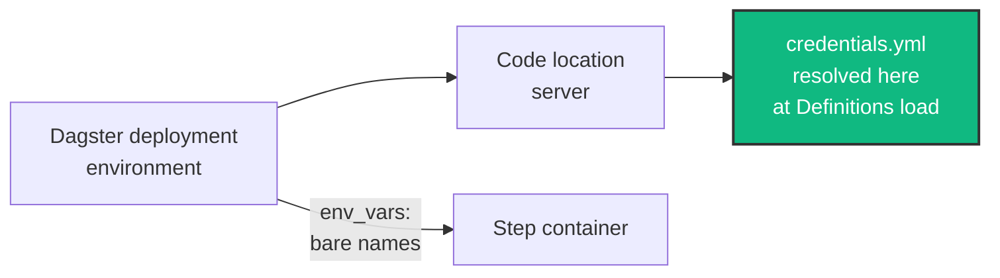

# How to Pass Database Credentials

This guide shows you how to get database credentials into a Kedro-Dagster deployment without writing secrets into any configuration file. Use this when your catalog reads from Postgres, MySQL, SQL Server, or any other credentialed source.

## Prerequisites

- A working Kedro-Dagster project ([Getting Started](../tutorials/getting-started.md))
- For containerized deployments: an executor that launches containers ([Configure Executors](configure-executors.md))

## The two halves

Credentials reach your nodes in two independent steps:

| Step | Where | What it does |
| --- | --- | --- |
| **Transport** | `dagster.yml`, `env_vars` | Forwards environment variables into step containers |
| **Consumption** | `credentials.yml`, `${oc.env:...}` | Reads those variables into the Kedro catalog |

Only the consumption half is universal. If you run locally with `in_process` or `multiprocess`, your pipeline already inherits the environment of the process that started it, so you can skip straight to [Consume the credentials](#2-consume-the-credentials).

!!! warning "`dagster.yml` does not interpolate environment variables"

    `${WAREHOUSE_USER}` and `${oc.env:WAREHOUSE_USER}` do **not** resolve in `dagster.yml`.
    The attempt raises at config load rather than being silently ignored. Kedro
    deliberately enables environment-variable resolution only for
    `credentials.yml`. See [Troubleshooting](troubleshoot.md#interpolationkeyerror-when-loading-dagsteryml).

## 1. Transport the variables

Declare the variable **names** under your executor's `env_vars`, without any values:

```yaml
executors:
  pipeline_docker:
    docker_executor:
      image: registry.example.com/my-project:latest
      env_vars:
        - WAREHOUSE_DSN
        - WAREHOUSE_USER
        - WAREHOUSE_PASSWORD

jobs:
  __default__:
    pipeline:
      pipeline_name: __default__
    executor: pipeline_docker
```

A bare name (no `=`) tells `dagster-docker` to read that variable from the environment of the process launching the container and inject it. No secret appears in the YAML, and the values come from whatever you configured in your Dagster deployment.

An entry may also take the `KEY=VALUE` form, but that hardcodes the value into configuration, so use it only for non-secret settings such as `KEDRO_ENV=production`.

!!! danger "`container_kwargs.environment` cannot be used"

    Passing environment variables through `container_kwargs` raises:

    ```
    'environment' should not be used in 'container_kwargs'. Use the 'env_vars' config key instead.
    ```

    `container_kwargs` is applied *after* the container environment is assembled, so an
    `environment` key there would overwrite the variables Dagster injects to track the run
    (`DAGSTER_RUN_JOB_NAME`, `DAGSTER_RUN_STEP_KEY`) and the step could no longer report
    its status. `image` and `network` are rejected for the same reason, so use the
    `image` and `networks` config keys instead.

## 2. Consume the credentials

`credentials.yml` is the one Kedro config file where `${oc.env:...}` resolves:

```yaml
warehouse:
  con: "${oc.env:WAREHOUSE_DSN}"
  username: "${oc.env:WAREHOUSE_USER}"
  password: "${oc.env:WAREHOUSE_PASSWORD}"
```

Reference the credentials entry from your catalog as usual:

```yaml
sales_transactions:
  type: pandas.SQLTableDataset
  table_name: transactions
  credentials: warehouse
```

## 3. Set the variables in both places

Kedro-Dagster builds the catalog when the code location loads its Dagster `Definitions`, not only when a step container runs. `credentials.yml` is therefore resolved in the **code location server** process.



The variables must be present in **both** the code location (or daemon) environment and forwarded into containers via `env_vars`. If you set them only on the container, loading `Definitions` fails before any run starts.

## See also

- [How to Configure Custom Executors](configure-executors.md): full `env_vars` and executor reference
- [Configuration Reference](../reference/configuration.md): every `dagster.yml` field
- [Troubleshooting](troubleshoot.md): the errors this guide prevents
